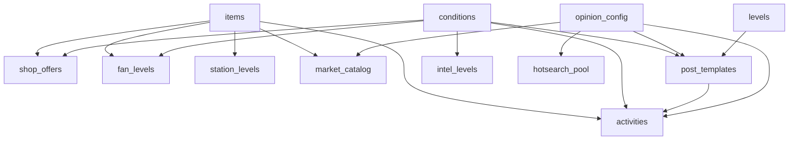

# 配表字段说明

**范围**：仅包含策划对话已确认的表与字段；未讨论内容不写入。  
**格式约定**：xlsx 第 1 行英文字段名、第 2 行类型、第 3 行中文说明、第 4 行起为数据。  
**文件名**：`xlsx表/` 下使用**中文文件名**（见下表）；`convert_tables.py` 转表时自动映射为英文 json。  
**转表**：运行项目根目录 `python convert_tables.py`，输出到 `data/*.json`。

### 文件名对照

| 中文 xlsx 文件名 | 输出 json |
|------------------|-----------|
| 道具表.xlsx | items.json |
| 条件表.xlsx | conditions.json |
| 投稿模板表.xlsx | post_templates.json |
| 活动表.xlsx | activities.json |
| 会员等级表.xlsx | fan_levels.json |
| 情报等级表.xlsx | intel_levels.json |
| 站子等级表.xlsx | station_levels.json |
| 商城上架表.xlsx | shop_offers.json |
| 热搜文本池表.xlsx | hotsearch_pool.json |
| 中转站目录表.xlsx | market_catalog.json |
| 舆论配置表.xlsx | opinion_config.json |
| 关卡表.xlsx | levels.json |
| 章节表.xlsx | chapters.json |
| 艺人帖表.xlsx | feed_posts.json |
| 背景音乐表.xlsx | bgm.json |
| 特效表.xlsx | effects.json |

---

## 买专辑 vs 升级会员

两步独立操作，共用同一背包（inventory）：

1. **买专辑**：在「购买周边 · 周边售卖」商品区，消耗饭圈积分 → 专辑作为道具入背包。
2. **升级会员**：在同一面板左侧会员区，消耗背包中**指定类型**的专辑 → 会员等级 +1。

升级按钮旁显示的持有数量 = 背包里符合 `fan_levels.costitemcategory` 的道具总数。签售专类型不同，不会被误消耗。

---

## 表间引用关系

---

## 1. 道具表 `道具表.xlsx`

全游戏道具统一配置，含货币、专辑、装备、活动解锁道具。

| 字段 | 说明 |
|------|------|
| itemid | 全局唯一数字编号 |
| name | 道具显示名 |
| category | 类型：1普通专辑 / 2签售专 / 3小卡 / 4娃孙 / 5潮牌 / 6活动解锁道具（生咖资格证、影通门票） / 22饭圈积分 / 23星星 / 24情报点 |
| desc | 道具描述 |
| stacklimit | 单格叠加上限；-1=无限 |
| icon | art/icons 静态帧 id，背包展示 |
| modelicon | art/model 模型 id（预留，暂不实现） |
| tradable | 0/1，是否可进中转站 |
| equipslot | 空=不可穿戴；填娃孙/小卡/潮牌 |

---

## 2. 条件表 `条件表.xlsx`

| 字段 | 说明 |
|------|------|
| id | 条件 ID |
| type | 条件类型（见下表） |
| param | 类型对应参数 |
| txt | 未满足时展示文案 |
| editor_note | 策划备注，不进游戏 JSON |

| type | 含义 | param |
|------|------|-------|
| 2 | 章节解锁 | 章节 id |
| 3 | 上一关已通关 | 0 |
| 5 | 情报等级 ≥ | 等级值 |
| 6 | 粉丝等级 ≥ | 等级值 |
| 7 | 背包持有道具 | 道具 itemid |

---

## 3. 投稿模板表 `投稿模板表.xlsx`

Fanclub 可产出、放置、收取的帖子模板。签售中签/未中签、嫂子帖、安利/反黑等均在此表配置，**无单独签售表**。

| 字段 | 说明 |
|------|------|
| postid | 投稿唯一 id |
| posttype | 投稿类型数字（枚举待策划填数） |
| tabtype | 归属页签：903嫂子站 / 904我的站子 / 0广场 |
| conditionid | 进抽取池条件；0=无条件 |
| tier | 稀有度 A/B/C |
| weightlow | 舆论负面档（0–50）抽取权重 |
| weightmid | 舆论正常档（50–80）权重 |
| weighthigh | 舆论极好档（80–100）权重 |
| uniquekey | 去重键，可空 |
| title | 帖子标题 |
| text | 帖子正文 |
| avatarpath | 头像 res:// 路径 |
| imagepath | 配图 res:// 路径 |
| durationsec | 曝光时长（秒）；0=秒结算 |
| maxparallel | 最大并行放置数 |
| grantfp | 收取给饭圈积分 |
| grantintel | 收取给情报点 |
| grantstars | 收取给星星 |
| opiniondelta | 玩家主动发帖时的舆论值变化；非主动帖填 0 |

**904 我的站子发帖**：玩家通关后获得发帖次数（见 levels.unlockpostcount），在 904 页签选择模板发送，舆论值 += opiniondelta。

---

## 4. 活动表 `活动表.xlsx`

含线下活动、签售、生咖、影通等，**签售无单独表**。

| 字段 | 说明 |
|------|------|
| activityid | 活动唯一 id |
| name | 活动名称 |
| category | 1放置 / 2线下 / 3签售 |
| conditionid | 参与门槛；0=无 |
| costfp | 消耗饭圈积分；0=不扣 |
| costitemid | 消耗道具编号（生咖/影通参与时消耗对应解锁道具） |
| costitemcount | 消耗道具数量 |
| outputposttype1 | 产出投稿类型 1（对应 post_templates.posttype） |
| outputposttype2 | 产出投稿类型 2；可空 |
| drawcount | 本次结算抽取帖数 |
| refreshmarket | 结算后刷新中转站 0/1 |
| tutorialonly | 教程必中 0/1 |
| sort | 列表排序 |
| stexplow | 舆论负面档贡献站子经验 |
| stexpmid | 舆论正常档贡献站子经验 |
| stexphigh | 舆论极好档贡献站子经验 |
| opinionlock | 受舆论限制 0/1；1=舆论低于恢复门槛时暂停 |

**生咖/影通**：站子等级奖励给 category=6 的道具 → 条件 type7 解锁活动 → 参与消耗同一道具 → 产出引用投稿模板表。

**站子经验**：每次活动结算后，按当前舆论档位取 stexplow/stexpmid/stexphigh 累加。

---

## 5. 会员等级表 `会员等级表.xlsx`

即粉丝等级，决定线下活动门槛与商城折扣。

| 字段 | 说明 |
|------|------|
| level | 等级数字 |
| name | 等级名称 |
| costitemcategory | 升级消耗道具类型（items.category，如 1=普通专辑） |
| costitemcount | 升级消耗数量 |
| shopdiscount | 商品折扣率；0=无；0.1=九折 |
| benefitdesc | 权益展示文案 |
| unlockconditionid | 本等级对应 type6 条件 id |

---

## 6. 情报等级表 `情报等级表.xlsx`

| 字段 | 说明 |
|------|------|
| level | 等级 |
| name | 名称 |
| thresholdintel | 所需情报点阈值 |
| unlockconditionid | 对应 type5 条件 id（艺人帖可见） |
| grantfp | 升级给饭圈积分 |
| grantstars | 升级给星星 |

---

## 7. 站子等级表 `站子等级表.xlsx`

| 字段 | 说明 |
|------|------|
| level | 等级 |
| name | 名称 |
| thresholdexp | 所需站子经验阈值 |
| rewarditemid | 等级奖励道具编号（如生咖资格证、影通门票） |
| rewarditemcount | 奖励数量 |
| idolkara | 0普通生咖 / 1艺人出席生咖 |
| videocallid | 影通事件 id（预留） |

站子经验来源：活动表三档 stexp 字段，参与次数累计。

---

## 8. 商城上架表 `商城上架表.xlsx`

| 字段 | 说明 |
|------|------|
| offerid | 上架 id |
| currencytype | 22饭圈积分 / 23星星 / 24情报点 |
| price | 售价 |
| itemid | 购买后给的道具 |
| shopdesc | 商城展示描述 |
| shopicon | art/icons 展示图 |
| conditionid | 显示条件；0=无条件 |
| stocklimit | -1=无限 |
| shoptab | 1周边售卖 / 2周边兑换 |
| tutorialonly | 0/1 |

---

## 9. 热搜文本池表 `热搜文本池表.xlsx`

| 字段 | 说明 |
|------|------|
| hotid | 热搜 id |
| opiniontier | 1负面 / 2正常 / 3极好 |
| hottext | 热搜展示文本 |
| weight | 同档位内随机权重 |

舆论档位变化后，按当前档位从此表随机抽取刷新 P2 右栏热搜。

---

## 10. 中转站目录表 `中转站目录表.xlsx`

| 字段 | 说明 |
|------|------|
| entryid | 条目 id |
| itemid | 道具编号 |
| tradetype | 1玩家卖出 / 2玩家买入 / 3双向 |
| pricelow | 舆论负面档价格（fp） |
| pricemid | 舆论正常档价格（fp） |
| pricehigh | 舆论极好档价格（fp） |
| conditionid | 显示条件；0=无条件 |
| refreshonactivity | 0/1，活动结算后刷新此条目 |

---

## 11. 舆论配置表 `舆论配置表.xlsx`

仅 1 行，全局舆论参数。

| 字段 | 说明 |
|------|------|
| tierlowmax | 负面档上限（50） |
| tiermidmax | 正常档上限（80） |
| tierhighmin | 极好档下限（80） |
| pauseat | 活动暂停门槛（0） |
| resumeat | 活动恢复门槛（10） |
| capat | 封顶触发值（100） |
| capresetto | 封顶后重置到（50） |
| capinfluxcount | 封顶涌入嫂子帖数量（3） |

### 舆论反馈循环（程序规则，不配表）

**刷新时机**：每关结算后，玩家选择完发帖内容，才刷新舆论档位。

**档位取值**：程序根据当前舆论值（0–100）判定档位 1/2/3，再从各表取对应列：
- 投稿模板表：weightlow / weightmid / weighthigh
- 活动表：stexplow / stexpmid / stexphigh
- 中转站：pricelow / pricemid / pricehigh

**边界事件**：
- 舆论 ≤ pauseat（0）：opinionlock=1 的活动暂停；904 发帖仅显示 opiniondelta > 0 的模板
- 舆论 ≥ resumeat（10）：演出类活动恢复
- 舆论 = capat（100）：按 capinfluxcount 从嫂子帖模板涌入实例，舆论强制设为 capresetto

**负面档反馈效果**（通过三档列配置实现）：
- 低质帖权重上升 → 积分效率降低
- 嫂子 A 档权重下降 → 优质嫂子帖减少
- 签售中签权重上升 → 中选率提高
- 接送机/上下班站子经验上升
- 中转站价格下降

---

## 12. 关卡表 `关卡表.xlsx`（新增字段）

在原有字段基础上，对话确认新增：

| 字段 | 说明 |
|------|------|
| grantstars | 通关给星星 |
| grantfp | 通关给饭圈积分 |
| grantintel | 通关给情报点 |
| unlockpostcount | 通关解锁发帖次数（904 我的站子） |

---

## 附录：迁入但未展开讨论的表

以下表已从 `data_src/` 根目录迁入 `xlsx表/`，维持原工程字段，详见 `data_src/00_表头约定.txt`：

| 文件 | 说明 |
|------|------|
| 章节表.xlsx | 章节配置 |
| 艺人帖表.xlsx | 艺人 Tab 901 静态帖（与投稿模板表分离） |
| 背景音乐表.xlsx | 背景音乐 |
| 特效表.xlsx | 特效资源 |

---

## 附录：单关配表（`data_src/levels/{关卡id}/`）

每关独立目录，四张 xlsx，转表输出到 `data/levels/{关卡id}/`：

| 中文 xlsx 文件名 | 输出 json |
|------------------|-----------|
| 关卡配置表.xlsx | level.json |
| 词条表.xlsx | vocab.json |
| 热点表.xlsx | hotspots.json |
| 槽位表.xlsx | slots.json |

> 单关「关卡配置表」≠ 全局「关卡表.xlsx」（后者 → levels.json 关卡列表）。

---

## 已否决、不创建的表

以下表在对话中明确合并或删除，**不在 xlsx表 目录维护**：

- reward_rules / cost_rules（奖励消耗内嵌到各表）
- sign_events / sign_event_pool（签售合入活动表 + 投稿模板表）
- event_types / events / expose_rules（合入投稿模板表）
